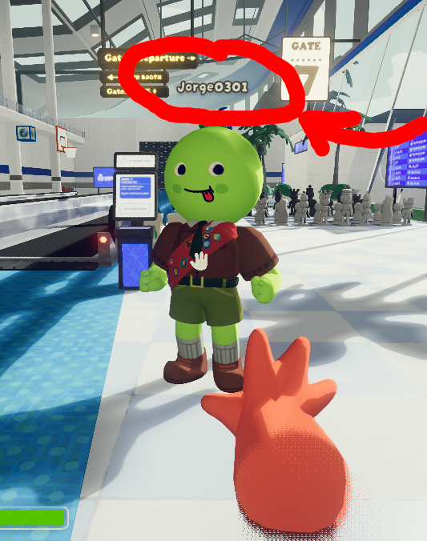
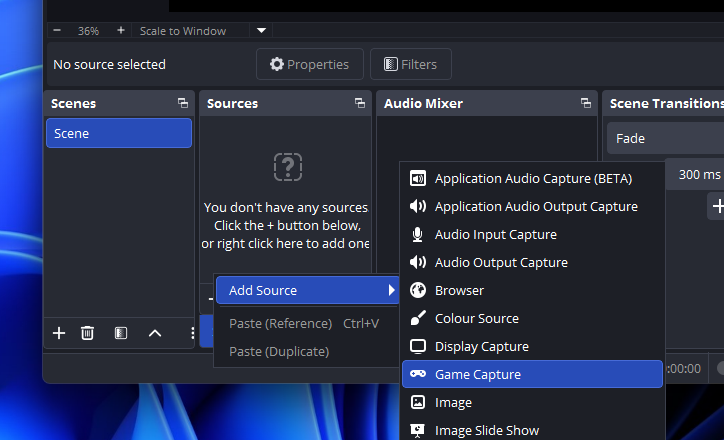
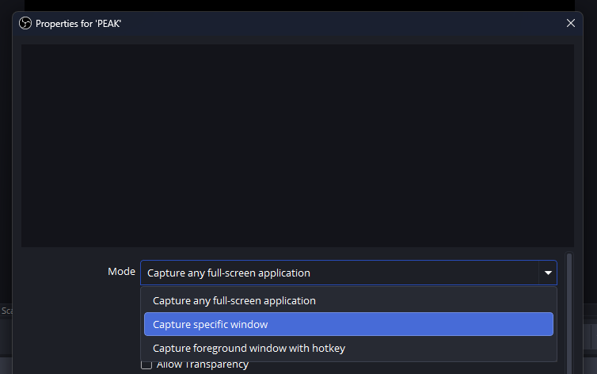
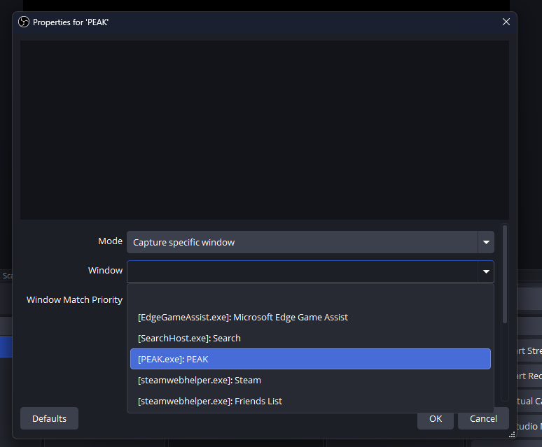
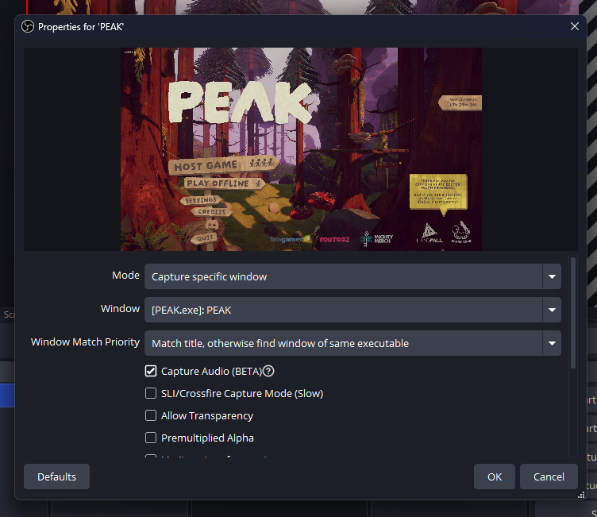

# PeakVoiceRedirect (PEAK / BepInEx Mono)

Mute a specific player **for the stream / game capture** while still hearing them locally.

This works by:
1) Tapping the remote player’s Photon Voice `Speaker` audio in Unity,
2) Muting the Voice w/SFX of the corresponding player from the game’s main audio mix (so OBS won’t hear it),
3) Sending that voice audio to a separate helper process (`VoicePipeHelper.exe`) that plays it back as its own audio stream.

Note:
This mod can also be used to isolate a player's voice to another channel with the purpose to apply sfx live or record voices separately for video editing

## Installation (manual)
Assuming [Bepinex Mono](https://docs.bepinex.dev/master/articles/user_guide/installation/unity_mono.html) is already installed, Unzip the release in `PEAK/Bepinex/Plugins`

## Choosing which players to isolate
Add the players you want to isolate in `PEAK/Bepinex/config/VoiceRedirect.cfg`

Make sure you write them exactly as they appear ingame (you may also restart the game to apply config changes)

## Using with OBS (so stream/recording wont hear isolated players' voices)

Create a *Game Capture* scene and set it to *Capture a specific window*

Launch PEAK if you haven't and select it in the `Window` field

Check the Capture Audio option

You might want to test before recording/streaming to verify it is setup correctly

## Building

To build you will require a `VoiceRedirect/VoiceRedirect/libs` folder with the following assemblies from the game (`PEAK/PEAK_Data/Managed`) with `PEAK` being the game root folder
- `Assembly-CSharp.dll`
- `PhotonVoice.dll`
- `Unity.TextMeshPro.dll`
- `UnityEngine.dll`
- `UnityEngine.CoreModule.dll`

You are welcome to repurpose this mod for other unity games with voicechat
